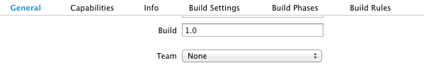
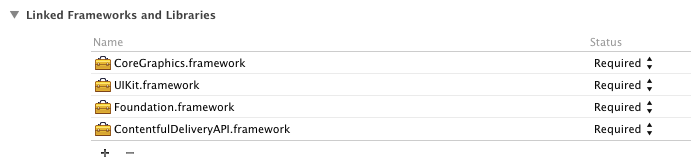
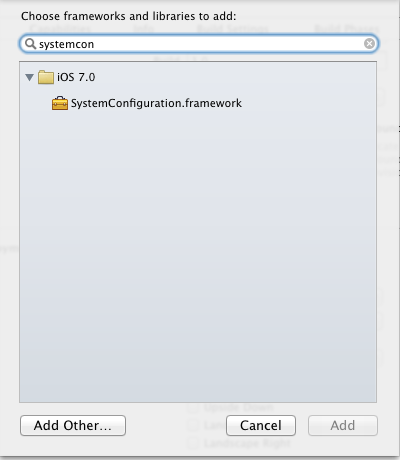

# contentful.objc

[](http://cocoadocs.org/docsets/ContentfulDeliveryAPI)
[](http://cocoadocs.org/docsets/ContentfulDeliveryAPI)
[](http://cocoadocs.org/docsets/ContentfulDeliveryAPI)
[](https://travis-ci.org/contentful/contentful.objc)
[](https://coveralls.io/r/contentful/contentful.objc?branch=master)

Objective-C SDK for [Contentful's][1] Content Delivery API.

[Contentful][1] is a content management platform for web applications, mobile apps and connected devices. It allows you to create, edit & manage content in the cloud and publish it anywhere via powerful API. Contentful offers tools for managing editorial teams and enabling cooperation between organizations.

## Usage

The `CDAClient` manages all your interaction with the Contentful Delivery API.

```objective-c
CDAClient* client = [[CDAClient alloc] initWithSpaceKey:@"cfexampleapi" accessToken:@"b4c0n73n7fu1"];
[client fetchEntryWithIdentifier:@"nyancat"
                         success:^(CDAResponse *response, CDAEntry *entry) {
                             NSLog(@"%@", entry.fields);
                         }
                         failure:^(CDAResponse *response, NSError *error) {
                             NSLog(@"%@", error);
                         }];
```

You can query for entries, assets, etc. with query options similar to what is described in the [Delivery API Documentation][6]:

```objective-c
[client fetchEntriesMatching:@{ @"content_type": @"cat" }
                     success:^(CDAResponse *response, CDAArray *entries) {
                         NSLog(@"%@", [[entries.items firstObject] fields]);
                     }
                     failure:^(CDAResponse *response, NSError *error) {
                         NSLog(@"%@", error);
                     }];
```

Results are returned as object of classes `CDAEntry`, `CDAAsset`, `CDAContentType` or `CDASpace`, depending on the fetch method being called. If there are multiple results, they will be returned as a `CDAArray` instance, which encapsulates the actual resources in the *items* property.

This repository contains multiple examples, demonstrating the use in common real world
scenarios and also showing the different ways you can integrate the SDK into your own project.

### Using Custom Entry Classes

You might want to subclass `CDAEntry` to store additional data alongside Entries or to decouple the rest of your app from the Contentful SDK's API. For this purpose, it is possible to register your own custom classes for specific Content Types, like this:

```objective-c
[client registerClass:[MYSuperCoolClass class] forContentTypeWithIdentifier:@"MyContentType"];
```

Each time, the receiver needs to create a new Entry object of the given Content Type, it will create instances of `MYSuperCoolClass`. Make sure that the class inherits from `CDAEntry` or this mechanism will break at runtime.

### Offline Support

Mobile devices will not always have a data connection, so it makes sense to cache data received from Contentful for offline use. The SDK brings two mechanisms which can help with that:

All Resource classes support `NSCoding` and bring convenience methods for storing and loading from flat files:

```objective-c
[someEntry writeToFile:@"/some/path"];
CDAEntry* readEntry = [CDAEntry readFromFile:@"/some/path" client:client];
```

The helper methods use [HRCoder][11] internally, to account for the possibility of circular links between Entries. Most of the UIKit extensions have an `offlineCaching` property which transparently uses this mechanism for showing content when offline.

If you rather use another solution, there is the abstract `CDAPersistenceManager` class with a [sample implementation](https://github.com/contentful/contentful.objc/blob/master/Code/CoreData/CoreDataManager.m) for Core Data. It supports mapping Resources to another method for managing your object graph easily and ties this to the Contentful synchronization API. Check out the Core Data example app for integrating it yourself.

In both cases, you can use the `offlineCaching_cda` property of the SDK's `UIImageView` category to make any image view transparently cache its contents in a flat file on disk. This will only cache images that the user has viewed once while the app was online.

### Preview Mode

The Content Delivery API only returns published Entries. However, you might want to preview content in your app before making it public for your users. For this, you can use the preview mode, which will return **all** Entries, regardless of their published status:

```objective-c
CDAConfiguration* configuration = [CDAConfiguration defaultConfiguration];
configuration.previewMode = YES;

CDAClient* client = [[CDAClient alloc] initWithSpaceKey:@"YourSpaceKey"
                                            accessToken:@"YourAccessToken"
                                          configuration:configuration];
```

Apart from the configuration option, you can use the SDK without modifications with one exception: you need to obtain a different access token from [here][10].  In preview mode, data can be invalid, because no validation is performed on unpublished entries. Your app needs to deal with that. Be aware that the access token is read-write and should in no case be shipped with a production app.

### UIKit Extensions

The SDK contains some extensions of UIKit classes for common use cases. You can see a lot of them in action in the examples or read [this blog post][12] with details on some of them.

## Documentation

For further information, check out the [Developer Documentation][6] or browse the [API documentation][7]. The latter can also be loaded into Xcode as a Docset.

## Installation

### CocoaPods

[CocoaPods][2] is a dependency manager for Objective-C, which automates and simplifies the process of using 3rd-party libraries like the Contentful Delivery API in your projects.

```ruby
platform :ios, '7.0'
pod 'ContentfulDeliveryAPI'
```

This is the easiest way to keep your copy of the Contentful Delivery API updated.

### Manual integration

In the case you prefer to manage your dependencies manually, you can just drag all files from the `Code` subdirectory into your project or integrate the `ContentfulDeliveryAPI` static library target into your build process. It might be a good idea to add this repository as a [Git submodule][5] if you choose this path.

Be aware that the Contentful Delivery API requires both [AFNetworking][3], [HRCoder][11] and [ISO8601DateFormatter][4] to compile successfully, so you need to provide these dependencies if you do manual integration.

### Static Framework

You can [download][8] the Contentful Delivery API as an universal static framework for iOS. Integrate it into your project by unzipping and dragging the `ContentfulDeliveryAPI.framework` into the `Frameworks` group of your project. You can also [download][9] the UFO example application including the static framework, as an example of integrating it into an Xcode project.

The static framework contains [AFNetworking][3], [HRCoder][11] and [ISO8601DateFormatter][4], so beware of linker errors if you already have those libraries in your project. If this is the case, you should use another method of installation.

It depends on the `SystemConfiguration.framework` not included by default in iOS projects, so open your project file on the `General` tab.



Click the `+` button in the `Linked Frameworks and Libraries` section at the bottom.



Search for *SystemConfiguration* and add the framework to your project.



Repeat that with *MobileCoreServices*, as that framework is also required to be in your project.

## Unit Tests

The Contentful Delivery API is fully unit tested.

To run the tests, do the following steps:

    $ gem install xcpretty cocoapods cocoapods-testing
    $ make test

or run them directly from Xcode.

## License

Copyright (c) 2014 Contentful GmbH. See LICENSE for further details.


[1]: https://www.contentful.com
[2]: http://www.cocoapods.org
[3]: http://www.afnetworking.com
[4]: http://boredzo.org/iso8601dateformatter/
[5]: http://git-scm.com/docs/git-submodule
[6]: https://www.contentful.com/developers/documentation/content-delivery-api/
[7]: http://cocoadocs.org/docsets/ContentfulDeliveryAPI/1.4.4/
[8]: http://static.contentful.com/downloads/iOS/ContentfulDeliveryAPI-1.4.4.zip
[9]: http://static.contentful.com/downloads/iOS/UFO.zip
[10]: https://www.contentful.com/developers/documentation/content-management-api/#getting-started
[11]: https://github.com/nicklockwood/HRCoder
[12]: https://www.contentful.com/blog/2014/04/04/Contentful-iOS-SDK/
